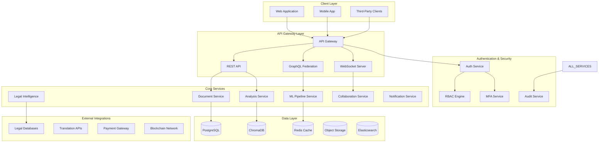

# Enhanced System Architecture - Arbitration Clause Detection Platform

## High-Level Architecture Overview



## Microservices Architecture Design

### Service Boundary Definitions

#### 1. **Document Management Service**
```python
# Core Responsibilities:
- Document upload, storage, and retrieval
- Version control and change tracking
- Document metadata management
- Multi-language document processing

# API Endpoints:
POST /api/v1/documents/upload
GET /api/v1/documents/{id}
PUT /api/v1/documents/{id}/versions
DELETE /api/v1/documents/{id}

# Database Schema:
documents: id, title, content_hash, language, jurisdiction, created_at
document_versions: id, document_id, version, changes, created_at
document_metadata: id, document_id, key, value
```

#### 2. **Analysis Engine Service**
```python
# Core Responsibilities:
- Arbitration clause detection
- Risk assessment and scoring
- Legal compliance checking
- Historical analysis comparison

# API Endpoints:
POST /api/v1/analysis/analyze
GET /api/v1/analysis/{id}/results
POST /api/v1/analysis/batch
GET /api/v1/analysis/history/{document_id}

# Database Schema:
analyses: id, document_id, analysis_type, results, confidence_score
risk_assessments: id, analysis_id, risk_level, factors, recommendations
compliance_checks: id, analysis_id, jurisdiction, status, violations
```

#### 3. **ML Pipeline Service**
```python
# Core Responsibilities:
- Model training and inference
- Feature extraction and embedding
- Continuous learning and improvement
- Model versioning and deployment

# API Endpoints:
POST /api/v1/ml/predict
GET /api/v1/ml/models/{id}/performance
POST /api/v1/ml/feedback
PUT /api/v1/ml/models/{id}/retrain

# Components:
- Feature extraction pipeline
- Ensemble model management
- Model performance monitoring
- Feedback integration system
```

#### 4. **Legal Intelligence Service**
```python
# Core Responsibilities:
- Legal database integration
- Citation extraction and validation
- Jurisdiction mapping and rules
- Legal precedent analysis

# API Endpoints:
GET /api/v1/legal/jurisdictions
POST /api/v1/legal/citations/validate
GET /api/v1/legal/precedents/search
POST /api/v1/legal/compliance/check

# External Integrations:
- Westlaw API
- LexisNexis database
- Google Scholar
- Local legal databases
```

#### 5. **Collaboration Service**
```python
# Core Responsibilities:
- Real-time document collaboration
- User presence and activity tracking
- Comment and annotation management
- Team workspace management

# API Endpoints:
WebSocket: /ws/collaboration/{document_id}
POST /api/v1/collaboration/comments
GET /api/v1/collaboration/activity/{document_id}
PUT /api/v1/collaboration/permissions

# Features:
- Real-time editing with conflict resolution
- User presence indicators
- Threaded comments and discussions
- Activity feeds and notifications
```

## Database Schema Design

### PostgreSQL - Primary Data Store

```sql
-- Users and Authentication
CREATE TABLE users (
    id UUID PRIMARY KEY DEFAULT gen_random_uuid(),
    email VARCHAR(255) UNIQUE NOT NULL,
    password_hash VARCHAR(255) NOT NULL,
    role VARCHAR(50) NOT NULL DEFAULT 'user',
    organization_id UUID REFERENCES organizations(id),
    is_active BOOLEAN DEFAULT true,
    created_at TIMESTAMP DEFAULT CURRENT_TIMESTAMP,
    updated_at TIMESTAMP DEFAULT CURRENT_TIMESTAMP
);

-- Organizations for multi-tenancy
CREATE TABLE organizations (
    id UUID PRIMARY KEY DEFAULT gen_random_uuid(),
    name VARCHAR(255) NOT NULL,
    domain VARCHAR(255),
    subscription_tier VARCHAR(50) DEFAULT 'free',
    settings JSONB,
    created_at TIMESTAMP DEFAULT CURRENT_TIMESTAMP
);

-- Documents with versioning
CREATE TABLE documents (
    id UUID PRIMARY KEY DEFAULT gen_random_uuid(),
    title VARCHAR(500) NOT NULL,
    content TEXT,
    content_hash VARCHAR(64) UNIQUE,
    language VARCHAR(10) DEFAULT 'en',
    jurisdiction VARCHAR(100),
    document_type VARCHAR(100),
    organization_id UUID REFERENCES organizations(id),
    uploaded_by UUID REFERENCES users(id),
    created_at TIMESTAMP DEFAULT CURRENT_TIMESTAMP,
    updated_at TIMESTAMP DEFAULT CURRENT_TIMESTAMP
);

-- Document versions for change tracking
CREATE TABLE document_versions (
    id UUID PRIMARY KEY DEFAULT gen_random_uuid(),
    document_id UUID REFERENCES documents(id) ON DELETE CASCADE,
    version_number INTEGER NOT NULL,
    content TEXT NOT NULL,
    changes JSONB,
    created_by UUID REFERENCES users(id),
    created_at TIMESTAMP DEFAULT CURRENT_TIMESTAMP,
    UNIQUE(document_id, version_number)
);

-- Analysis results
CREATE TABLE analyses (
    id UUID PRIMARY KEY DEFAULT gen_random_uuid(),
    document_id UUID REFERENCES documents(id) ON DELETE CASCADE,
    analysis_type VARCHAR(100) NOT NULL,
    has_arbitration_clause BOOLEAN,
    confidence_score DECIMAL(5,4),
    results JSONB NOT NULL,
    metadata JSONB,
    created_by UUID REFERENCES users(id),
    created_at TIMESTAMP DEFAULT CURRENT_TIMESTAMP
);

-- Risk assessments
CREATE TABLE risk_assessments (
    id UUID PRIMARY KEY DEFAULT gen_random_uuid(),
    analysis_id UUID REFERENCES analyses(id) ON DELETE CASCADE,
    overall_risk_level VARCHAR(20) NOT NULL,
    risk_factors JSONB NOT NULL,
    recommendations JSONB,
    severity_scores JSONB,
    created_at TIMESTAMP DEFAULT CURRENT_TIMESTAMP
);

-- Legal compliance tracking
CREATE TABLE compliance_checks (
    id UUID PRIMARY KEY DEFAULT gen_random_uuid(),
    document_id UUID REFERENCES documents(id) ON DELETE CASCADE,
    jurisdiction VARCHAR(100) NOT NULL,
    compliance_status VARCHAR(50) NOT NULL,
    violations JSONB,
    recommendations JSONB,
    checked_at TIMESTAMP DEFAULT CURRENT_TIMESTAMP
);

-- Collaboration features
CREATE TABLE document_comments (
    id UUID PRIMARY KEY DEFAULT gen_random_uuid(),
    document_id UUID REFERENCES documents(id) ON DELETE CASCADE,
    user_id UUID REFERENCES users(id),
    content TEXT NOT NULL,
    position_start INTEGER,
    position_end INTEGER,
    thread_id UUID,
    is_resolved BOOLEAN DEFAULT false,
    created_at TIMESTAMP DEFAULT CURRENT_TIMESTAMP
);

-- Audit trail
CREATE TABLE audit_logs (
    id UUID PRIMARY KEY DEFAULT gen_random_uuid(),
    user_id UUID REFERENCES users(id),
    action VARCHAR(100) NOT NULL,
    resource_type VARCHAR(100),
    resource_id UUID,
    details JSONB,
    ip_address INET,
    user_agent TEXT,
    created_at TIMESTAMP DEFAULT CURRENT_TIMESTAMP
);

-- Indexes for performance
CREATE INDEX idx_documents_organization ON documents(organization_id);
CREATE INDEX idx_documents_created_at ON documents(created_at);
CREATE INDEX idx_analyses_document ON analyses(document_id);
CREATE INDEX idx_analyses_created_at ON analyses(created_at);
CREATE INDEX idx_audit_logs_user_action ON audit_logs(user_id, action);
CREATE INDEX idx_audit_logs_created_at ON audit_logs(created_at);

-- Full-text search indexes
CREATE INDEX idx_documents_content_fts ON documents USING GIN(to_tsvector('english', content));
CREATE INDEX idx_documents_title_fts ON documents USING GIN(to_tsvector('english', title));
```

### ChromaDB - Vector Store Schema

```python
# Vector Collection Configuration
collections = {
    "legal_documents": {
        "embedding_function": "sentence-transformers/all-MiniLM-L6-v2",
        "metadata_schema": {
            "document_id": str,
            "chunk_id": str,
            "jurisdiction": str,
            "language": str,
            "document_type": str,
            "confidence_score": float,
            "legal_category": str
        }
    },
    "legal_precedents": {
        "embedding_function": "sentence-transformers/legal-bert-base-uncased",
        "metadata_schema": {
            "case_id": str,
            "court": str,
            "year": int,
            "jurisdiction": str,
            "precedent_strength": float
        }
    },
    "arbitration_patterns": {
        "embedding_function": "sentence-transformers/all-MiniLM-L6-v2",
        "metadata_schema": {
            "pattern_type": str,
            "severity_level": str,
            "jurisdiction": str,
            "effectiveness_score": float
        }
    }
}
```

### Redis - Caching Strategy

```python
# Cache Key Patterns and TTL
cache_patterns = {
    "analysis:document:{document_id}": 3600,  # 1 hour
    "legal:jurisdiction:{jurisdiction}": 86400,  # 24 hours
    "user:session:{user_id}": 1800,  # 30 minutes
    "ml:model:predictions:{model_id}": 7200,  # 2 hours
    "legal:precedents:{query_hash}": 43200,  # 12 hours
    "compliance:rules:{jurisdiction}": 86400,  # 24 hours
}

# Distributed Cache Configuration
redis_config = {
    "cluster_nodes": [
        {"host": "redis-node-1", "port": 6379},
        {"host": "redis-node-2", "port": 6379},
        {"host": "redis-node-3", "port": 6379}
    ],
    "decode_responses": True,
    "health_check_interval": 30
}
```

## API Design Specifications

### RESTful API Endpoints

#### Document Management API
```yaml
/api/v1/documents:
  post:
    summary: Upload new document
    parameters:
      - name: file
        in: formData
        type: file
        required: true
      - name: jurisdiction
        in: formData
        type: string
      - name: document_type
        in: formData
        type: string
    responses:
      201:
        description: Document uploaded successfully
        schema:
          $ref: '#/definitions/Document'
      400:
        description: Invalid file format
      413:
        description: File too large

  get:
    summary: List documents with pagination
    parameters:
      - name: page
        in: query
        type: integer
        default: 1
      - name: limit
        in: query
        type: integer
        default: 20
      - name: filter
        in: query
        type: string
      - name: sort
        in: query
        type: string
        enum: [created_at, title, jurisdiction]
    responses:
      200:
        description: List of documents
        schema:
          type: object
          properties:
            documents:
              type: array
              items:
                $ref: '#/definitions/Document'
            pagination:
              $ref: '#/definitions/Pagination'
```

#### Analysis API
```yaml
/api/v1/analysis/analyze:
  post:
    summary: Analyze document for arbitration clauses
    requestBody:
      required: true
      content:
        application/json:
          schema:
            type: object
            properties:
              document_id:
                type: string
                format: uuid
              analysis_type:
                type: string
                enum: [full, quick, compliance]
              options:
                type: object
                properties:
                  include_risk_assessment: boolean
                  include_suggestions: boolean
                  target_jurisdiction: string
    responses:
      200:
        description: Analysis completed
        content:
          application/json:
            schema:
              $ref: '#/definitions/AnalysisResult'
      202:
        description: Analysis queued for processing
        content:
          application/json:
            schema:
              type: object
              properties:
                analysis_id: 
                  type: string
                  format: uuid
                status:
                  type: string
                  enum: [queued, processing, completed, failed]
```

### GraphQL Schema
```graphql
type Query {
  document(id: ID!): Document
  documents(
    filter: DocumentFilter
    pagination: PaginationInput
    sort: DocumentSort
  ): DocumentConnection
  
  analysis(id: ID!): Analysis
  analyses(documentId: ID!): [Analysis!]!
  
  legalPrecedents(
    query: String!
    jurisdiction: String
    limit: Int = 10
  ): [LegalPrecedent!]!
  
  complianceStatus(
    documentId: ID!
    jurisdiction: String!
  ): ComplianceResult
}

type Mutation {
  uploadDocument(input: DocumentUploadInput!): DocumentUploadResult!
  analyzeDocument(input: AnalysisInput!): AnalysisResult!
  updateDocumentMetadata(id: ID!, input: DocumentMetadataInput!): Document!
  deleteDocument(id: ID!): Boolean!
  
  addComment(input: CommentInput!): Comment!
  resolveComment(id: ID!): Comment!
  
  updateUserProfile(input: UserProfileInput!): User!
}

type Subscription {
  analysisProgress(analysisId: ID!): AnalysisProgress!
  documentCollaboration(documentId: ID!): CollaborationEvent!
  systemNotifications(userId: ID!): Notification!
}

type Document {
  id: ID!
  title: String!
  content: String
  language: String!
  jurisdiction: String
  documentType: String
  organization: Organization!
  uploadedBy: User!
  createdAt: DateTime!
  updatedAt: DateTime!
  
  # Related data
  analyses: [Analysis!]!
  versions: [DocumentVersion!]!
  comments: [Comment!]!
  complianceStatus: [ComplianceResult!]!
}

type Analysis {
  id: ID!
  document: Document!
  analysisType: AnalysisType!
  hasArbitrationClause: Boolean!
  confidenceScore: Float!
  riskAssessment: RiskAssessment
  suggestions: [Suggestion!]!
  metadata: JSON
  createdAt: DateTime!
  createdBy: User!
}

type RiskAssessment {
  overallRiskLevel: RiskLevel!
  riskFactors: [RiskFactor!]!
  severityScores: JSON!
  recommendations: [Recommendation!]!
  complianceIssues: [ComplianceIssue!]!
}
```

## Technology Stack Recommendations

### Backend Services
```yaml
Core Framework: FastAPI 0.104+
Database: PostgreSQL 15+ with TimescaleDB extension
Vector Store: ChromaDB 0.4+ or Pinecone
Cache: Redis 7+ Cluster
Message Queue: Apache Kafka or AWS SQS
Search Engine: Elasticsearch 8+
File Storage: AWS S3 or MinIO
```

### ML/AI Stack
```yaml
ML Framework: PyTorch 2.0+ / TensorFlow 2.13+
NLP Models: 
  - sentence-transformers/all-MiniLM-L6-v2
  - legal-bert-base-uncased
  - multilingual-e5-large
LLM Integration: OpenAI GPT-4, Anthropic Claude
Model Serving: TorchServe or TensorFlow Serving
Feature Store: Feast or AWS SageMaker
```

### Infrastructure
```yaml
Container Platform: Kubernetes 1.28+
Service Mesh: Istio 1.19+
API Gateway: Kong or AWS API Gateway
Monitoring: Prometheus + Grafana
Logging: ELK Stack (Elasticsearch, Logstash, Kibana)
Tracing: Jaeger or Zipkin
CI/CD: GitLab CI or GitHub Actions
```

### Frontend Technologies
```yaml
Web Framework: React 18+ with Next.js 14+
Mobile Framework: React Native 0.72+
State Management: Redux Toolkit or Zustand
UI Components: Material-UI or Ant Design
Charts/Analytics: D3.js or Chart.js
Real-time: Socket.io or native WebSockets
```

## Security Architecture

### Authentication & Authorization
```yaml
Authentication:
  - JWT with refresh token rotation
  - OAuth2 with PKCE for web/mobile
  - SAML 2.0 for enterprise SSO
  - Multi-factor authentication (TOTP/SMS)

Authorization:
  - Role-based access control (RBAC)
  - Attribute-based access control (ABAC)
  - Resource-level permissions
  - API key management for third-party access
```

### Data Protection
```yaml
Encryption:
  - TLS 1.3 for data in transit
  - AES-256 for data at rest
  - Field-level encryption for sensitive data
  - Key management with AWS KMS or HashiCorp Vault

Privacy:
  - GDPR compliance with data anonymization
  - CCPA data deletion and portability
  - PII detection and masking
  - Consent management system
```

### Security Monitoring
```yaml
Monitoring:
  - Real-time threat detection
  - API abuse detection and rate limiting
  - Security information and event management (SIEM)
  - Vulnerability scanning and assessment

Compliance:
  - SOC 2 Type II certification
  - ISO 27001 compliance
  - HIPAA compliance for healthcare clients
  - Regular security audits and penetration testing
```

## Performance Optimization Strategy

### Database Optimization
```sql
-- Partitioning strategy for large tables
CREATE TABLE documents_partitioned (
    LIKE documents INCLUDING ALL
) PARTITION BY RANGE (created_at);

-- Create monthly partitions
CREATE TABLE documents_2024_01 PARTITION OF documents_partitioned
    FOR VALUES FROM ('2024-01-01') TO ('2024-02-01');

-- Indexes for query optimization
CREATE INDEX CONCURRENTLY idx_documents_org_created 
    ON documents(organization_id, created_at DESC);
    
CREATE INDEX CONCURRENTLY idx_analyses_document_type 
    ON analyses(document_id, analysis_type) 
    WHERE has_arbitration_clause = true;
```

### Caching Strategy
```python
# Multi-level caching implementation
cache_levels = {
    "L1": {
        "type": "in_memory",
        "size": "512MB",
        "ttl": 300,  # 5 minutes
        "use_case": "frequently_accessed_data"
    },
    "L2": {
        "type": "redis_cluster",
        "size": "16GB",
        "ttl": 3600,  # 1 hour
        "use_case": "session_data_analysis_results"
    },
    "L3": {
        "type": "cdn",
        "size": "unlimited",
        "ttl": 86400,  # 24 hours
        "use_case": "static_resources_legal_templates"
    }
}
```

### Load Balancing & Scaling
```yaml
Horizontal Scaling:
  - Auto-scaling based on CPU/memory usage
  - Queue-based scaling for ML processing
  - Geographic load distribution
  - Database read replicas for query scaling

Vertical Scaling:
  - Resource optimization for ML models
  - Memory management for large documents
  - CPU optimization for text processing
  - Storage optimization for vector embeddings
```

## Deployment Architecture

### Kubernetes Configuration
```yaml
apiVersion: apps/v1
kind: Deployment
metadata:
  name: arbitration-api
  namespace: legal-tech
spec:
  replicas: 3
  selector:
    matchLabels:
      app: arbitration-api
  template:
    metadata:
      labels:
        app: arbitration-api
    spec:
      containers:
      - name: api
        image: arbitration-api:latest
        ports:
        - containerPort: 8000
        env:
        - name: DATABASE_URL
          valueFrom:
            secretKeyRef:
              name: db-secrets
              key: url
        resources:
          requests:
            memory: "512Mi"
            cpu: "250m"
          limits:
            memory: "1Gi"
            cpu: "500m"
        livenessProbe:
          httpGet:
            path: /health
            port: 8000
          initialDelaySeconds: 30
          periodSeconds: 10
        readinessProbe:
          httpGet:
            path: /ready
            port: 8000
          initialDelaySeconds: 5
          periodSeconds: 5
```

### Multi-Region Deployment
```yaml
Regions:
  Primary: us-east-1 (N. Virginia)
  Secondary: eu-west-1 (Ireland)
  Asia-Pacific: ap-southeast-1 (Singapore)

Data Replication:
  - PostgreSQL streaming replication
  - ChromaDB cross-region sync
  - Redis cluster replication
  - S3 cross-region replication

Disaster Recovery:
  - RTO: 15 minutes
  - RPO: 5 minutes
  - Automated failover
  - Data backup every 6 hours
```

This comprehensive architecture provides a solid foundation for building a scalable, secure, and high-performance legal technology platform that can handle enterprise-level workloads while maintaining compliance with legal industry requirements.