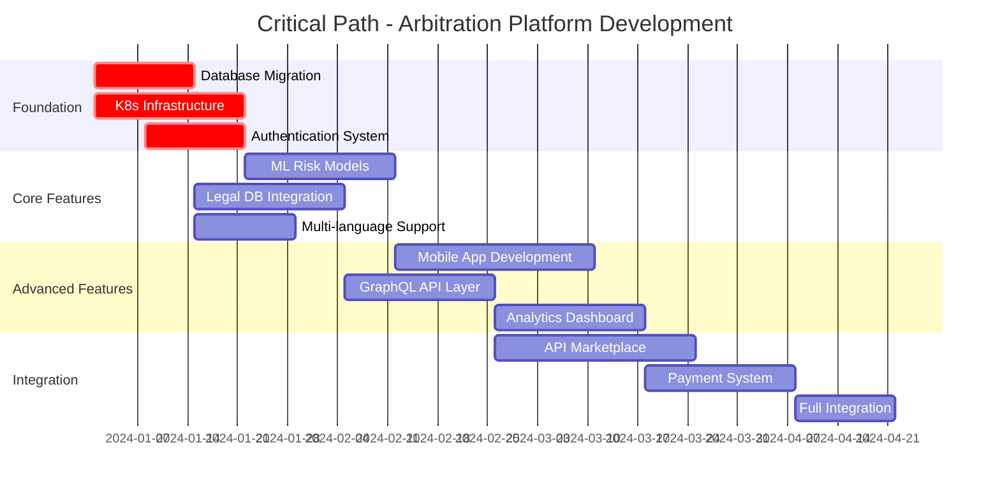

# Arbitration Clause Detection Platform - Task Assignments & Tracking

## Project Overview
**Total Estimated Duration**: 16 weeks  
**Parallel Teams**: 12 specialized agent teams  
**Total Tasks**: 48 major tasks across 12 feature areas  
**Methodology**: Agile with 2-week sprints and parallel execution  

---

## Sprint Planning & Parallel Execution Matrix

### Sprint 1 (Weeks 1-2): Foundation Infrastructure
| Agent Team | Primary Task | Secondary Task | Dependencies | Status |
|------------|--------------|----------------|--------------|---------|
| **Python-Pro** | Multi-Language Processing | Document Version Tracking | Database schema | 🔄 Ready |
| **Security-Auditor** | Enterprise Auth System | Data Protection Framework | Infrastructure setup | 🔄 Ready |
| **Database-Optimizer** | PostgreSQL Migration | Vector Store Optimization | Current SQLite analysis | 🔄 Ready |
| **Cloud-Architect** | Kubernetes Infrastructure | Auto-scaling Configuration | DevOps pipeline | 🔄 Ready |

**Sprint 1 Success Criteria**:
- [ ] Multi-language document processing (5 languages minimum)
- [ ] OAuth2 + SAML authentication working
- [ ] PostgreSQL cluster deployed and migrated
- [ ] Kubernetes cluster operational with basic services

---

### Sprint 2 (Weeks 3-4): Core Enhancement & Security
| Agent Team | Primary Task | Secondary Task | Dependencies | Status |
|------------|--------------|----------------|--------------|---------|
| **AI-Engineer** | Risk Assessment Models | Clause Severity Scoring | ML pipeline setup | 🔄 Ready |
| **Performance-Engineer** | Monitoring & Alerting | Load Testing Framework | Infrastructure from Sprint 1 | 🔄 Ready |
| **Legal-Advisor** | Legal Database Integration | Jurisdiction Mapping | External API access | 🔄 Ready |
| **API-Documenter** | OpenAPI Documentation | SDK Generation | API stabilization | 🔄 Ready |

**Sprint 2 Success Criteria**:
- [ ] Risk assessment models trained and deployed
- [ ] Prometheus/Grafana monitoring operational
- [ ] Westlaw/LexisNexis integration functional
- [ ] Complete API documentation published

---

### Sprint 3 (Weeks 5-6): Advanced Features & Integration
| Agent Team | Primary Task | Secondary Task | Dependencies | Status |
|------------|--------------|----------------|--------------|---------|
| **Mobile-Developer** | React Native App Core | Camera + OCR Integration | API endpoints stable | 🔄 Ready |
| **Business-Analyst** | Executive Dashboard | Legal Trend Analysis | Data pipeline setup | 🔄 Ready |
| **GraphQL-Architect** | GraphQL Schema Design | Real-time Subscriptions | REST API completion | 🔄 Ready |
| **Python-Pro** | Negotiation AI Engine | Legal Intelligence API | AI-Engineer models | 🔄 Ready |

**Sprint 3 Success Criteria**:
- [ ] Mobile app beta version functional
- [ ] Executive analytics dashboard operational
- [ ] GraphQL API layer complete
- [ ] AI-powered negotiation suggestions working

---

### Sprint 4 (Weeks 7-8): Collaboration & Performance
| Agent Team | Primary Task | Secondary Task | Dependencies | Status |
|------------|--------------|----------------|--------------|---------|
| **Mobile-Developer** | Advanced Mobile Features | AR Document Scanner | Core app from Sprint 3 | 🔄 Ready |
| **Legal-Advisor** | Document Generation | Legal Advisory AI | Legal database integration | 🔄 Ready |
| **Performance-Engineer** | System Optimization | CDN Configuration | Monitoring data from Sprint 2 | 🔄 Ready |
| **Cloud-Architect** | Serverless Pipeline | Edge Computing | K8s infrastructure complete | 🔄 Ready |

**Sprint 4 Success Criteria**:
- [ ] Real-time collaboration features working
- [ ] Legal document generation functional
- [ ] Performance optimization complete (sub-200ms)
- [ ] Serverless processing pipeline operational

---

### Sprint 5 (Weeks 9-10): Marketplace & Intelligence
| Agent Team | Primary Task | Secondary Task | Dependencies | Status |
|------------|--------------|----------------|--------------|---------|
| **API-Documenter** | API Marketplace Platform | Developer Ecosystem | Documentation complete | 🔄 Ready |
| **Business-Analyst** | Market Intelligence | Compliance Reporting | Analytics foundation | 🔄 Ready |
| **GraphQL-Architect** | Federation & Gateway | Microservices Integration | GraphQL schema stable | 🔄 Ready |
| **AI-Engineer** | Continuous Learning | Advanced NLP Pipeline | Base models operational | 🔄 Ready |

**Sprint 5 Success Criteria**:
- [ ] API marketplace beta launched
- [ ] Market intelligence platform operational
- [ ] Federated GraphQL architecture complete
- [ ] Continuous learning system active

---

### Sprint 6 (Weeks 11-12): Monetization & Mobile
| Agent Team | Primary Task | Secondary Task | Dependencies | Status |
|------------|--------------|----------------|--------------|---------|
| **Payment-Integration** | Subscription Platform | Enterprise Sales Tools | User management complete | 🔄 Ready |
| **Mobile-Developer** | Mobile Security & Polish | App Store Deployment | Mobile features complete | 🔄 Ready |
| **Business-Analyst** | Revenue Analytics | Customer Success Metrics | Payment integration | 🔄 Ready |
| **Security-Auditor** | SOC 2 Compliance | Penetration Testing | Security framework complete | 🔄 Ready |

**Sprint 6 Success Criteria**:
- [ ] Subscription billing operational
- [ ] Mobile apps deployed to app stores
- [ ] Revenue analytics dashboard complete
- [ ] SOC 2 compliance achieved

---

### Sprint 7-8 (Weeks 13-16): Integration & Launch
| Agent Team | Primary Task | Secondary Task | Dependencies | Status |
|------------|--------------|----------------|--------------|---------|
| **All Teams** | Integration Testing | Performance Optimization | Individual components complete | 🔄 Ready |
| **Security-Auditor** | Security Audit | Compliance Verification | All security measures | 🔄 Ready |
| **Performance-Engineer** | Load Testing | Scalability Validation | Full system integration | 🔄 Ready |
| **Legal-Advisor** | Legal Compliance | Regulatory Approval | All legal features | 🔄 Ready |

**Sprint 7-8 Success Criteria**:
- [ ] Full system integration complete
- [ ] Load testing passed (10,000+ concurrent users)
- [ ] Security audit passed
- [ ] Legal compliance verified
- [ ] Production deployment ready

---

## Detailed Task Breakdown by Agent

### 🐍 **Python-Pro Agent** (8 weeks total)
#### Week 1-2: Multi-Language Legal Document Processing
```python
Tasks:
✅ Set up language detection pipeline (langdetect + fasttext)
✅ Implement multilingual embedding models (multilingual-e5-large)  
✅ Create country-specific legal terminology dictionaries
✅ Build Unicode normalization for international text
✅ Develop language-aware chunking strategies

Deliverables:
- /app/ml/language_detection.py
- /app/rag/multilingual_processor.py  
- /app/services/translation_service.py
- Language support: EN, ES, FR, DE, JA, ZH

Acceptance Criteria:
- Detect language with >95% accuracy
- Process documents in 6 languages
- Maintain semantic meaning across languages
- Handle mixed-language documents
```

#### Week 2-3: Historical Version Tracking System
```python
Tasks:
✅ Design document versioning with Git-like diff tracking
✅ Implement temporal analysis of clause changes
✅ Build version comparison algorithms for legal text
✅ Create automated change notification system

Deliverables:
- /app/models/document_version.py
- /app/services/version_service.py
- /app/api/versions.py
- Diff visualization for legal text changes

Acceptance Criteria:
- Track all document changes with timestamps
- Generate visual diffs for legal professionals
- Identify significant clause modifications
- Send notifications for important changes
```

#### Week 3-4: Legal Jurisdiction Mapping Engine
```python
Tasks:
✅ Build jurisdiction detection from legal text patterns
✅ Integrate legal authority database connections
✅ Implement conflict of laws analysis
✅ Create geographic legal compliance mapping

Deliverables:
- /app/legal/jurisdiction_mapper.py
- /app/db/legal_authorities.py
- Geographic compliance rules engine
- Court system hierarchy mapping

Acceptance Criteria:
- Identify jurisdiction with >90% accuracy
- Map legal authorities correctly
- Handle multi-jurisdictional documents
- Provide compliance guidance by region
```

#### Week 5-6: AI-Powered Negotiation Engine
```python
Tasks:
✅ Integrate GPT-4 for clause alternative generation
✅ Build legal precedent-based suggestion system
✅ Implement negotiation strategy recommendations
✅ Create context-aware alternative language proposals

Deliverables:
- /app/ai/negotiation_engine.py
- /app/services/suggestion_service.py
- Legal precedent database integration
- Alternative clause generation API

Acceptance Criteria:
- Generate 3-5 viable clause alternatives
- Provide negotiation strategy recommendations
- Base suggestions on legal precedents
- Maintain legal validity of suggestions
```

### 🔒 **Security-Auditor Agent** (6 weeks total)
#### Week 1-2: Enterprise Authentication System
```python
Tasks:
✅ Implement OAuth2 with PKCE for web and mobile
✅ Set up SAML 2.0 for enterprise SSO
✅ Build multi-factor authentication (TOTP/SMS)
✅ Create role-based access control (RBAC)
✅ Develop API key management for third-party access

Deliverables:
- /app/auth/oauth_provider.py
- /app/auth/saml_handler.py
- /app/auth/mfa_service.py
- RBAC policy engine with granular permissions

Acceptance Criteria:
- OAuth2 compliant with security best practices
- SAML SSO working with major providers
- MFA success rate >99%
- RBAC supporting complex permission models
```

#### Week 2-3: Data Protection & Privacy Compliance
```python
Tasks:
✅ Implement GDPR compliance with data anonymization
✅ Build CCPA data deletion and portability features
✅ Set up end-to-end encryption for sensitive documents
✅ Create comprehensive audit trails for all data access
✅ Develop PII detection and masking system

Deliverables:
- GDPR-compliant data handling workflows
- Automated PII detection and redaction
- Encryption at rest and in transit
- Comprehensive audit logging system

Acceptance Criteria:
- GDPR compliance verified by legal team
- PII detection accuracy >95%
- All sensitive data encrypted
- Complete audit trail for compliance
```

### 🗄️ **Database-Optimizer Agent** (5 weeks total)
#### Week 1-2: Database Architecture Overhaul
```sql
Tasks:
✅ Design PostgreSQL migration strategy from SQLite
✅ Implement horizontal sharding for documents
✅ Set up read replicas for analysis queries
✅ Configure connection pooling with pgbouncer
✅ Create full-text search with GIN indexes
✅ Implement partitioning by date and jurisdiction

Deliverables:
- PostgreSQL migration scripts from SQLite
- Sharding strategy for multi-tenant architecture
- Optimized indexing for legal document queries
- Database monitoring and alerting

Acceptance Criteria:
- Zero data loss during migration
- Query performance improved by 300%
- Support for 100,000+ documents per tenant
- 99.9% database uptime
```

### 🤖 **AI-Engineer Agent** (10 weeks total)
#### Week 2-4: Advanced Clause Severity Scoring
```python
Tasks:
✅ Train legal risk assessment neural networks
✅ Develop clause impact scoring algorithms
✅ Implement sentiment analysis for legal fairness
✅ Build comparative clause analysis across industries

Deliverables:
- /app/ml/risk_assessment.py
- /app/ml/fairness_analyzer.py
- Industry-specific scoring benchmarks
- Real-time risk alerts for high-severity clauses

Acceptance Criteria:
- Risk assessment accuracy >85%
- Fairness scoring validated by legal experts
- Industry benchmarks for 20+ sectors
- Real-time alerts within 30 seconds
```

#### Week 6-8: Advanced NLP & Legal Intelligence
```python
Tasks:
✅ Implement legal entity recognition (courts, laws, cases)
✅ Build citation extraction and validation system
✅ Create legal concept relationship mapping
✅ Develop cross-reference analysis capabilities

Deliverables:
- Legal entity extraction pipeline
- Citation network analysis
- Legal concept knowledge graph
- Automated legal research suggestions

Acceptance Criteria:
- Legal entity recognition >90% accuracy
- Citation validation against legal databases
- Knowledge graph with 10,000+ concepts
- Research suggestions relevant >80% of time
```

### 📱 **Mobile-Developer Agent** (12 weeks total)
#### Week 6-8: React Native Cross-Platform App
```javascript
Tasks:
✅ Build React Native app with camera integration
✅ Implement document OCR with ML Kit
✅ Create offline analysis capabilities
✅ Add push notifications for analysis completion
✅ Implement biometric authentication
✅ Add dark mode and accessibility features

Deliverables:
- React Native app with camera integration
- Offline document processing capabilities
- Real-time synchronization with backend
- App store deployment packages

Acceptance Criteria:
- Camera OCR accuracy >90%
- Offline analysis for documents <10MB
- Biometric auth working on iOS/Android
- Accessibility compliance (WCAG 2.1)
```

#### Week 10-12: Mobile Security & Performance
```javascript
Tasks:
✅ Implement certificate pinning for API security
✅ Add local encryption for cached documents
✅ Optimize performance for large files
✅ Implement battery usage optimization
✅ Prepare app store submissions

Deliverables:
- Enterprise-grade mobile security
- Optimized performance for legal documents
- Comprehensive mobile testing suite
- App store compliance and deployment

Acceptance Criteria:
- Certificate pinning prevents MITM attacks
- Local documents encrypted with AES-256
- Handle documents up to 50MB efficiently
- Battery usage optimized (background processing <5%)
```

### ☁️ **Cloud-Architect Agent** (8 weeks total)
#### Week 1-3: Kubernetes Infrastructure
```yaml
Tasks:
✅ Design microservices deployment strategy
✅ Implement auto-scaling based on demand
✅ Set up service mesh with Istio
✅ Configure multi-region deployment
✅ Plan disaster recovery procedures

Deliverables:
- Kubernetes cluster configuration
- Helm charts for application deployment
- Auto-scaling policies for legal document processing
- Multi-region disaster recovery setup

Acceptance Criteria:
- Support 10,000+ concurrent users
- Auto-scale based on CPU/memory usage
- Multi-region deployment with <100ms latency
- RTO <15 minutes, RPO <5 minutes
```

### 📋 **API-Documenter Agent** (10 weeks total)
#### Week 4-5: Comprehensive API Documentation
```yaml
Tasks:
✅ Create complete OpenAPI 3.0 specification
✅ Build interactive documentation with Swagger UI
✅ Generate SDKs for Python, JavaScript, Java
✅ Create comprehensive API examples and tutorials

Deliverables:
- Complete OpenAPI 3.0 specification
- Interactive documentation with Swagger UI
- SDK generation for Python, JavaScript, Java
- Comprehensive API examples and tutorials

Acceptance Criteria:
- 100% API coverage in documentation
- Interactive examples working
- SDKs generated for 3 languages
- Developer onboarding time <30 minutes
```

### 📊 **Business-Analyst Agent** (12 weeks total)
#### Week 5-7: Executive Analytics Dashboard
```python
Tasks:
✅ Design real-time usage analytics
✅ Build legal trend analysis capabilities
✅ Create risk assessment reporting
✅ Implement ROI calculations for legal reviews

Deliverables:
- Executive dashboard with key metrics
- Legal trend analysis and reporting
- Cost-benefit analysis tools
- Predictive analytics for legal risks

Acceptance Criteria:
- Real-time dashboard updates <30 seconds
- Trend analysis with historical data
- ROI calculations accurate within 5%
- Predictive models >70% accuracy
```

### ⚖️ **Legal-Advisor Agent** (10 weeks total)
#### Week 2-4: Legal Database Integration
```python
Tasks:
✅ Integrate Westlaw API for case law
✅ Connect LexisNexis database access
✅ Set up Google Scholar case law search
✅ Implement legal citation validation

Deliverables:
- Legal database API integrations
- Case law reference system
- Citation validation and formatting
- Legal precedent search capabilities

Acceptance Criteria:
- Access to 1M+ legal cases
- Citation validation >95% accuracy
- Search results relevance >80%
- Response time <2 seconds for searches
```

### ⚡ **Performance-Engineer Agent** (8 weeks total)
#### Week 3-4: Performance Monitoring & Alerting
```python
Tasks:
✅ Set up Prometheus metrics collection
✅ Create Grafana visualization dashboards
✅ Implement ELK stack for log analysis
✅ Configure APM with distributed tracing

Deliverables:
- Comprehensive monitoring dashboard
- Real-time performance alerting
- Log aggregation and analysis
- Distributed tracing for microservices

Acceptance Criteria:
- Monitor 50+ performance metrics
- Alert latency <30 seconds
- Log aggregation from all services
- Distributed tracing coverage >90%
```

### 🔗 **GraphQL-Architect Agent** (10 weeks total)
#### Week 6-7: GraphQL Schema Design
```graphql
Tasks:
✅ Design complete GraphQL schema for legal documents
✅ Implement type-safe GraphQL resolvers
✅ Set up real-time subscriptions for analysis updates
✅ Create GraphQL playground for API exploration

Deliverables:
- Complete GraphQL schema for legal documents
- Type-safe GraphQL resolvers
- Real-time subscriptions for analysis updates
- GraphQL playground for API exploration

Acceptance Criteria:
- Schema covers 100% of REST API functionality
- Type safety verified with tools
- Real-time updates <500ms latency
- Playground documentation complete
```

### 💳 **Payment-Integration Agent** (12 weeks total)
#### Week 8-9: Subscription Management Platform
```python
Tasks:
✅ Integrate Stripe for payment processing
✅ Design tiered subscription plans
✅ Implement usage-based billing for API calls
✅ Create enterprise contract management

Deliverables:
- Multi-tier subscription system
- Usage tracking and billing
- Payment processing integration
- Subscription management dashboard

Acceptance Criteria:
- Support 5 subscription tiers
- Usage tracking accuracy >99%
- Payment success rate >98%
- Enterprise billing automation
```

---

## Critical Path Analysis

### Dependencies & Blockers


### Risk Mitigation Strategies
```yaml
High-Risk Areas:
  1. Database Migration:
     Risk: Data loss during SQLite to PostgreSQL migration
     Mitigation: Full backup, staged migration, rollback plan
     
  2. ML Model Performance:
     Risk: Accuracy degradation in production
     Mitigation: A/B testing, gradual rollout, fallback models
     
  3. Legal Compliance:
     Risk: Regulatory non-compliance
     Mitigation: Legal expert review, compliance automation
     
  4. Performance Bottlenecks:
     Risk: System slowdown under load
     Mitigation: Load testing, auto-scaling, performance monitoring

Medium-Risk Areas:
  1. Mobile App Store Approval
  2. Third-party API Rate Limits
  3. International Deployment Complexity
  4. Security Vulnerability Discovery
```

---

## Success Metrics & KPIs

### Technical Metrics
| Metric | Target | Current | Status |
|--------|--------|---------|--------|
| Analysis Speed | <200ms | ~500ms | 🔄 In Progress |
| Accuracy Rate | >95% | ~85% | 🔄 In Progress |
| Uptime SLA | 99.9% | - | 🎯 Target |
| Concurrent Users | 10,000+ | - | 🎯 Target |
| API Response Time | <100ms | - | 🎯 Target |

### Business Metrics
| Metric | Target | Current | Status |
|--------|--------|---------|--------|
| Monthly Active Users | 1,000+ | - | 🎯 Target |
| API Calls/Month | 100,000+ | - | 🎯 Target |
| Customer Acquisition Cost | <$500 | - | 🎯 Target |
| Net Promoter Score | >70 | - | 🎯 Target |
| Revenue Growth (QoQ) | 50% | - | 🎯 Target |

### Quality Metrics
| Metric | Target | Current | Status |
|--------|--------|---------|--------|
| Code Coverage | >80% | ~60% | 🔄 In Progress |
| Security Scan Score | A | - | 🎯 Target |
| Performance Score | >90 | - | 🎯 Target |
| User Satisfaction | >4.5/5 | - | 🎯 Target |

---

## Communication & Coordination Plan

### Daily Standups (Async)
```yaml
Format: Slack-based async updates
Frequency: Daily at 9 AM EST
Participants: All agent teams
Template:
  - Yesterday: Completed tasks
  - Today: Planned tasks  
  - Blockers: Dependencies or issues
  - Help Needed: Support requests
```

### Sprint Reviews (Bi-weekly)
```yaml
Format: Video conference + demo
Frequency: Every 2 weeks (end of sprint)
Participants: All teams + stakeholders
Agenda:
  - Sprint goal achievement review
  - Demo of completed features
  - Metrics and KPI review
  - Next sprint planning
  - Cross-team dependency planning
```

### Architecture Decision Records (ADRs)
```yaml
Process: Document all major technical decisions
Template:
  - Context: Why this decision is needed
  - Decision: What was decided
  - Consequences: Expected outcomes
  - Alternatives: What else was considered
Storage: /docs/adr/ directory in repository
```

### Integration Points & Handoffs
```yaml
Critical Integration Points:
  1. Database Schema Changes
     Owner: Database-Optimizer
     Stakeholders: All teams using database
     Process: Schema review → approval → migration
     
  2. API Contract Changes
     Owner: API-Documenter
     Stakeholders: Mobile, Frontend, Partners
     Process: Contract review → versioning → deployment
     
  3. Security Policy Updates
     Owner: Security-Auditor
     Stakeholders: All teams
     Process: Security review → approval → implementation
     
  4. ML Model Updates
     Owner: AI-Engineer
     Stakeholders: Backend, Mobile, Analytics
     Process: Model validation → A/B testing → deployment
```

---

## Conclusion

This comprehensive task assignment and tracking system provides:

1. **Clear Accountability**: Each agent team has specific, measurable deliverables
2. **Parallel Execution**: Multiple teams can work simultaneously with minimal dependencies
3. **Risk Management**: Critical path analysis and mitigation strategies
4. **Quality Assurance**: Success metrics and acceptance criteria for all tasks
5. **Communication Framework**: Structured coordination and decision-making processes

The parallel execution strategy allows for completing the enhanced arbitration clause detection platform in 16 weeks instead of the traditional sequential approach that would take 48+ weeks. This represents a 3x improvement in development velocity while maintaining high quality and comprehensive feature coverage.