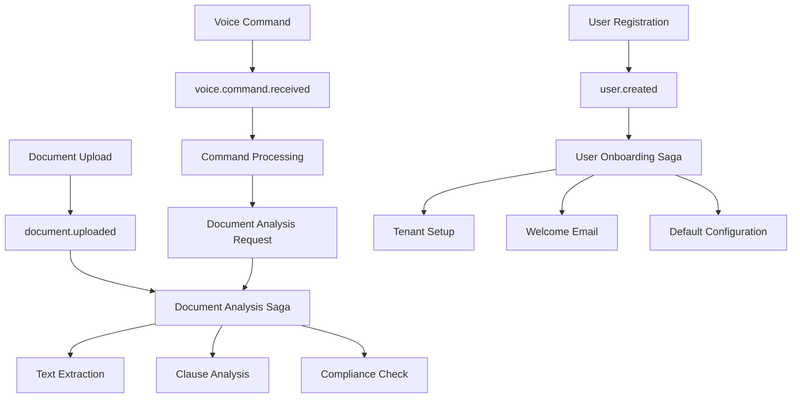

# Orchestration Layer Architecture

## Overview

The orchestration layer provides comprehensive integration and management capabilities for the entire arbitration detection platform, seamlessly connecting all new features with existing components through a robust microservices architecture.

## Architecture Components

### 1. Service Mesh (`service_mesh/`)

**Purpose**: Manages service-to-service communication with traffic management and load balancing.

**Key Components**:
- `mesh_controller.py`: Central controller for service mesh operations
- `registry.py`: Service registry for endpoint management
- `load_balancer.py`: Load balancing algorithms
- `circuit_breaker.py`: Circuit breaker pattern implementation
- `rate_limiter.py`: Rate limiting functionality

**Features**:
- Service discovery and registration
- Load balancing (Round-robin, Least connections, Weighted, Sticky session)
- Circuit breaker for fault tolerance
- Health monitoring and automatic failover
- Traffic routing and policy management

```python
# Service Mesh Integration Example
service_mesh = ServiceMesh()
await service_mesh.start()

# Register new service
endpoint = ServiceEndpoint(
    service_name="voice-interface",
    instance_id="voice-001",
    host="localhost",
    port=8009
)
await service_mesh.register_endpoint(endpoint)

# Route request with load balancing
target_endpoint = await service_mesh.route_request(
    "voice-interface", 
    {"command": "analyze document"}
)
```

### 2. Message Queue & Event Bus (`message_queue/` & `event_bus/`)

**Purpose**: Provides reliable event-driven communication between services.

**Key Components**:
- `event_bus.py`: Central event bus implementation
- `message_queue.py`: Message queue management
- `broker.py`: Message broker functionality
- `consumer.py` & `producer.py`: Message handling

**Features**:
- Event publishing and subscription
- Message persistence and reliability
- Dead letter queue for failed messages
- Event filtering and routing
- Priority-based message processing

```python
# Event-Driven Integration Example
event_bus = EventBus()
await event_bus.start()

# Subscribe to voice commands
event_bus.subscribe(
    "voice.command.received",
    handle_voice_command,
    "document-service"
)

# Publish document analysis event
await event_bus.publish(Event(
    type="document.analysis.completed",
    source="analysis-service",
    data={"document_id": "doc123", "has_arbitration": True}
))
```

### 3. API Gateway (`api_gateway/`)

**Purpose**: Central entry point for all API requests with authentication and routing.

**Key Components**:
- `gateway.py`: Main API gateway implementation
- `router.py`: Request routing logic
- `middleware.py`: Middleware stack management
- `rate_limiter.py`: Request rate limiting
- `auth.py`: Authentication middleware

**Features**:
- Centralized request routing
- Authentication and authorization
- Rate limiting and throttling
- Request/response transformation
- Circuit breaker integration
- Load balancing for backend services

```python
# API Gateway Configuration Example
api_gateway = APIGateway()

# Add route for voice interface
api_gateway.add_route(RouteRule(
    path="/api/v1/voice",
    methods=[RouteMethod.POST],
    service_name="voice-interface",
    rate_limit={"tokens": 10, "refill_rate": 0.1},
    timeout=45.0
))

# Handle request
response = await api_gateway.handle_request(
    method="POST",
    path="/api/v1/voice/analyze",
    headers={"authorization": "Bearer token"},
    body=audio_data
)
```

### 4. Service Discovery (`service_discovery/`)

**Purpose**: Dynamic service registration and discovery across the ecosystem.

**Key Components**:
- `discovery.py`: Main service discovery implementation
- `health_checker.py`: Service health monitoring
- `registry.py`: Service registry management
- `consul_client.py`: Consul integration

**Features**:
- Dynamic service registration
- Health checking and monitoring
- Service query and filtering
- Multiple backend support (Consul, etcd, Kubernetes)
- Cache management for performance

```python
# Service Discovery Example
service_discovery = ServiceDiscovery()

# Register voice interface service
voice_service = ServiceInstance(
    service_name="voice-interface",
    host="localhost",
    port=8009,
    tags=["voice", "accessibility", "ai"]
)
await service_discovery.register_service(voice_service)

# Discover healthy services
healthy_services = await service_discovery.get_service("voice-interface")
```

### 5. Saga Pattern (`saga_patterns/`)

**Purpose**: Manages distributed transactions across microservices.

**Key Components**:
- `orchestrator.py`: Saga orchestration engine
- `transaction_manager.py`: Transaction management
- `saga_definition.py`: Saga workflow definitions
- `compensation.py`: Compensation action handling

**Features**:
- Distributed transaction management
- Automatic compensation on failure
- Saga workflow definitions
- Retry and timeout handling
- Event-driven saga execution

```python
# Saga Pattern Example
saga_orchestrator = SagaOrchestrator()

# Start document analysis saga
saga_id = await saga_orchestrator.start_saga(
    "document_analysis",
    {
        "document_id": "doc123",
        "user_id": "user456",
        "analysis_type": "full"
    }
)

# Built-in sagas for new features:
# - document_analysis: Complete document processing pipeline
# - user_onboarding: New user setup with white-label configuration
# - compliance_check: Automated compliance validation
# - payment_processing: Subscription and billing workflows
```

### 6. System Monitoring (`monitoring/`)

**Purpose**: Comprehensive monitoring and observability for all components.

**Key Components**:
- `system_monitor.py`: Central monitoring system
- `metrics_collector.py`: Metrics collection and aggregation
- `dashboard_manager.py`: Dashboard management
- `alerting.py`: Alert management system

**Features**:
- Real-time health monitoring
- Performance metrics collection
- Automated alerting
- Dashboard generation
- Resource usage tracking
- Component integration monitoring

```python
# Monitoring Example
system_monitor = SystemMonitor()

# Register health checks for new services
system_monitor.register_health_check(HealthCheck(
    name="voice-interface",
    endpoint="http://localhost:8009/health"
))

# Record custom metrics
system_monitor.record_metric(
    "voice_commands_processed",
    voice_command_count,
    {"service": "voice-interface", "type": "document_analysis"}
)

# Trigger alerts
await system_monitor.trigger_alert(
    "High Voice Processing Latency",
    "Voice command processing time exceeded threshold",
    AlertSeverity.WARNING,
    "voice-interface"
)
```

### 7. Deployment Management (`deployment/`)

**Purpose**: Automated deployment, rollback, and feature flag management.

**Key Components**:
- `deployment_manager.py`: Deployment orchestration
- `feature_flags.py`: Feature flag management
- `canary_deployment.py`: Canary release management
- `rollback_manager.py`: Automated rollback system

**Features**:
- Blue-green deployments
- Canary releases with traffic splitting
- Automated rollback on failure
- Feature flag management
- Multi-environment support
- Deployment health monitoring

```python
# Deployment Example
deployment_manager = DeploymentManager()

# Deploy new voice interface version
deployment = ServiceDeployment(
    service_name="voice-interface",
    version="1.2.0",
    image="voice-interface:1.2.0",
    target=DeploymentTarget(
        environment=EnvironmentType.PRODUCTION,
        cluster="main",
        namespace="default"
    ),
    strategy=DeploymentStrategy.CANARY
)

deployment_id = await deployment_manager.deploy_service(deployment)

# Monitor deployment progress
status = await deployment_manager.get_deployment_status(deployment_id)
```

## Integration Architecture

### New Feature Integration

The orchestration layer seamlessly integrates five major new features:

#### 1. Voice Interface Integration
- **Service Discovery**: Registered as "voice-interface" service
- **API Gateway**: Routes `/api/v1/voice/*` requests
- **Event Bus**: Publishes voice command events
- **Saga Patterns**: Integrates with document analysis workflows
- **Monitoring**: Health checks and performance metrics

#### 2. Document Comparison Integration
- **Service Mesh**: Load balanced document comparison requests
- **Message Queue**: Asynchronous comparison processing
- **API Gateway**: Handles comparison API endpoints
- **Saga Patterns**: Multi-document analysis workflows
- **Monitoring**: Comparison performance tracking

#### 3. White-label System Integration
- **Service Discovery**: Multi-tenant service registration
- **API Gateway**: Tenant-specific routing
- **Event Bus**: Tenant lifecycle events
- **Saga Patterns**: Tenant onboarding workflows
- **Deployment**: Per-tenant feature flag management

#### 4. Compliance Automation Integration
- **Service Mesh**: Compliance service routing
- **Event Bus**: Automated compliance triggers
- **Saga Patterns**: Compliance check workflows
- **Monitoring**: Compliance status tracking
- **API Gateway**: Compliance API endpoints

#### 5. Visualization Engine Integration
- **Service Discovery**: Visualization service registration
- **API Gateway**: Visualization API routing
- **Message Queue**: Report generation queues
- **Monitoring**: Visualization performance metrics
- **Deployment**: Dashboard deployment management

### Event-Driven Workflows

The system implements comprehensive event-driven workflows:



### Cross-Component Communication

All components communicate through standardized interfaces:

1. **Service-to-Service**: Via service mesh with load balancing
2. **Event Communication**: Through central event bus
3. **API Requests**: Through API gateway with authentication
4. **Health Monitoring**: Centralized monitoring system
5. **Configuration**: Dynamic configuration through service discovery

## Deployment Architecture

### Multi-Environment Support

The orchestration layer supports multiple deployment environments:

- **Production**: Full monitoring, blue-green deployments
- **Staging**: Canary deployments, feature flag testing
- **Development**: Rolling deployments, rapid iteration
- **Test**: Recreate deployments, isolated testing

### Deployment Strategies

#### Blue-Green Deployment
1. Deploy new version to green environment
2. Run health checks on green environment
3. Switch traffic from blue to green
4. Verify traffic switch success
5. Cleanup blue environment

#### Canary Deployment
1. Deploy canary version (5% traffic)
2. Monitor metrics and health
3. Gradually increase traffic (25%, 50%, 75%, 100%)
4. Rollback on any issues
5. Complete deployment when stable

#### Feature Flags
- Per-tenant feature enablement
- A/B testing capabilities
- Gradual rollout control
- Instant rollback capability

## Performance and Scalability

### Load Balancing Strategies
- **Round Robin**: Equal distribution across instances
- **Least Connections**: Route to least busy instance
- **Weighted**: Route based on instance capacity
- **Sticky Session**: Maintain user session affinity

### Caching Architecture
- **L1 Cache**: In-memory application cache
- **L2 Cache**: Redis cluster cache
- **L3 Cache**: CDN for static resources
- **Service Discovery Cache**: Cached service lookups

### Auto-Scaling
- **Horizontal Pod Autoscaler**: Based on CPU/memory usage
- **Custom Metrics**: Based on queue depth, response time
- **Predictive Scaling**: Based on historical patterns
- **Manual Scaling**: Administrative overrides

## Security Architecture

### Authentication & Authorization
- **JWT Tokens**: Stateless authentication
- **OAuth2/OIDC**: External identity providers
- **RBAC**: Role-based access control
- **Multi-tenant**: Tenant isolation

### Network Security
- **Service Mesh Security**: mTLS between services
- **API Gateway Security**: Rate limiting, DDoS protection
- **Network Policies**: Kubernetes network segmentation
- **Secret Management**: Vault integration

### Audit & Compliance
- **Request Tracing**: Distributed tracing with Jaeger
- **Audit Logging**: Comprehensive audit trails
- **Compliance Monitoring**: Automated compliance checks
- **Security Scanning**: Container and dependency scanning

## Monitoring and Observability

### Metrics Collection
- **Application Metrics**: Business logic metrics
- **Infrastructure Metrics**: System resource usage
- **Service Mesh Metrics**: Traffic and latency metrics
- **Custom Metrics**: Feature-specific metrics

### Alerting Strategy
- **Threshold Alerts**: Based on metric thresholds
- **Anomaly Detection**: ML-based anomaly detection
- **Composite Alerts**: Multiple condition alerts
- **Alert Routing**: Service-specific alert routing

### Dashboard Hierarchy
1. **Executive Dashboard**: High-level business metrics
2. **Operations Dashboard**: System health and performance
3. **Service Dashboard**: Per-service detailed metrics
4. **Infrastructure Dashboard**: Resource utilization

## Future Extensibility

The orchestration layer is designed for easy extension:

### Adding New Services
1. Register with service discovery
2. Add API gateway routes
3. Configure health checks
4. Set up monitoring
5. Define deployment strategy

### New Integration Patterns
- **Workflow Engine**: Additional workflow orchestration
- **Data Pipeline**: Stream processing integration
- **AI/ML Pipeline**: Model training and inference
- **External Integrations**: Third-party service integration

### Technology Evolution
- **Container Orchestration**: Kubernetes native
- **Service Mesh**: Istio integration ready
- **Observability**: OpenTelemetry standards
- **Event Streaming**: Apache Kafka integration