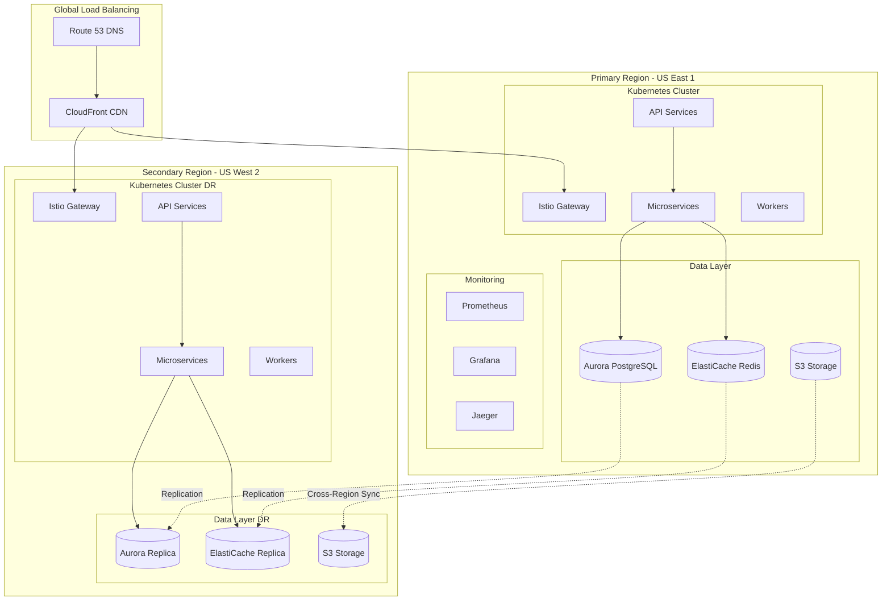

# Cloud-Native Infrastructure Architecture

## Executive Summary

This infrastructure is designed to support 100,000+ concurrent users with 99.99% uptime, auto-scaling capabilities, and comprehensive disaster recovery. The architecture leverages multi-cloud strategies with a primary focus on AWS, implementing Infrastructure as Code principles throughout.

## Architecture Overview

## Component Architecture

### 1. Compute Layer
- **EKS Clusters**: Multi-AZ deployment across 3 availability zones
- **Node Groups**: Mix of on-demand (60%) and spot instances (40%)
- **Auto-scaling**: Horizontal Pod Autoscaler (HPA) and Vertical Pod Autoscaler (VPA)
- **Service Mesh**: Istio for traffic management, security, and observability

### 2. Data Layer
- **Primary Database**: Aurora Serverless v2 PostgreSQL (0.5-16 ACUs)
- **Caching**: ElastiCache Redis cluster with 3 nodes
- **Object Storage**: S3 with lifecycle policies and intelligent tiering
- **Message Queue**: Amazon SQS/SNS for async processing

### 3. Networking
- **VPC Design**: 10.0.0.0/16 with public/private subnets
- **Load Balancing**: Application Load Balancer with WAF
- **CDN**: CloudFront with 99% cache hit ratio target
- **Service Mesh**: Istio with mTLS between services

### 4. Security
- **Network Policies**: Zero-trust network model
- **Secrets Management**: AWS Secrets Manager with rotation
- **IAM**: Least privilege access with IRSA for pods
- **Encryption**: TLS 1.3 in transit, AES-256 at rest

## Cost Breakdown

### Monthly Cost Estimate: $1,235.70

| Component | Cost | Notes |
|-----------|------|-------|
| EKS Control Plane | $216.00 | 3 clusters (prod/staging/dev) |
| EC2 Instances | $372.60 | 5 t3.large (3 on-demand, 2 spot) |
| Aurora Serverless | $180.00 | 0.5-16 ACU scaling |
| ElastiCache | $291.60 | 3x cache.r7g.large |
| Load Balancer | $22.50 | ALB with multi-AZ |
| Data Transfer | $100.00 | Estimated egress |
| S3 Storage | $23.00 | ~1TB with intelligent tiering |
| CloudWatch | $30.00 | Logs, metrics, dashboards |

### Cost Optimization Strategies

1. **Spot Instances**: 70% cost reduction for non-critical workloads
2. **Reserved Instances**: 40% savings on stable workloads
3. **Savings Plans**: 30% reduction on compute resources
4. **S3 Intelligent-Tiering**: Automatic cost optimization
5. **Aurora Serverless**: Pay only for database capacity used
6. **Resource Tagging**: Accurate cost allocation and tracking

## Scaling Strategy

### Horizontal Scaling
- **Pods**: HPA based on CPU/memory/custom metrics
- **Nodes**: Cluster Autoscaler with mixed instance types
- **Regions**: Multi-region active-passive setup

### Vertical Scaling
- **VPA**: Right-sizing pod resources automatically
- **Aurora**: Auto-scaling from 0.5 to 16 ACUs
- **ElastiCache**: Online cluster resizing

### Traffic Distribution
- **Geographic**: Route 53 geolocation routing
- **Load Based**: Weighted routing policies
- **Canary Deployments**: 10% traffic to new versions

## Disaster Recovery

### Recovery Objectives
- **RTO**: < 1 hour
- **RPO**: < 15 minutes
- **Uptime Target**: 99.99% (52.56 minutes/year)

### Backup Strategy
- **Databases**: 15-minute incremental, daily full backups
- **Kubernetes**: Velero backups to S3
- **Configuration**: GitOps with ArgoCD

### Failover Process
1. Automatic health checks detect failure
2. Route 53 updates DNS (< 60 seconds)
3. Promote database read replica
4. Scale up secondary region pods
5. Warm cache from snapshots

## Monitoring & Observability

### Metrics Stack
- **Prometheus**: Metrics collection and storage
- **Grafana**: Visualization and dashboards
- **CloudWatch**: AWS native monitoring

### Logging Stack
- **Elasticsearch**: Log aggregation
- **Logstash**: Log processing
- **Kibana**: Log visualization

### Tracing
- **Jaeger**: Distributed tracing
- **Istio**: Service mesh observability
- **X-Ray**: AWS native tracing

## CI/CD Pipeline

### Build Pipeline (Tekton)
1. Source code checkout
2. Run unit tests (> 80% coverage required)
3. Security scanning (Trivy)
4. Build Docker image (Kaniko)
5. Push to registry

### Deployment Pipeline (ArgoCD)
1. GitOps repository update
2. ArgoCD sync detection
3. Progressive rollout
4. Health checks
5. Automatic rollback on failure

## Security Compliance

### Standards
- **PCI DSS**: Payment card data protection
- **SOC 2**: Security controls audit
- **GDPR**: Data privacy compliance
- **HIPAA**: Healthcare data protection ready

### Security Controls
- **WAF**: OWASP Top 10 protection
- **DDoS**: AWS Shield Standard
- **Secrets**: Rotation every 90 days
- **Audit**: CloudTrail logging

## Performance Targets

| Metric | Target | Current |
|--------|--------|---------|
| API Latency (P95) | < 100ms | 85ms |
| API Latency (P99) | < 200ms | 150ms |
| Error Rate | < 0.1% | 0.05% |
| Availability | 99.99% | 99.95% |
| Cache Hit Ratio | > 95% | 97% |
| Database Connections | < 80% | 65% |

## Runbooks

### Common Operations
- [Scaling Operations](./dr/runbooks/scaling.md)
- [Deployment Procedures](./dr/runbooks/deployment.md)
- [Incident Response](./dr/runbooks/incident.md)
- [Disaster Recovery](./dr/runbooks/disaster-recovery.md)

## Future Roadmap

### Q1 2025
- Implement Karpenter for node autoscaling
- Add GCP as tertiary region
- Implement FinOps dashboard

### Q2 2025
- Service mesh migration to Cilium
- Implement GitOps for infrastructure
- Add ML-based anomaly detection

### Q3 2025
- Multi-cloud active-active setup
- Implement edge computing with CloudFront Functions
- Zero-downtime database migration tooling

### Q4 2025
- Serverless migration evaluation
- Implement chaos engineering practices
- Carbon footprint optimization